# Logistic System

## Application Overview and Functionality

### **Application Overview**
This application simulates a logistic system, based on the movimentation of cargo containers which are exchanged in a loop between two port terminals, representing the city of Bari and Busan. 
This exchange is made possible by a single cargo ship, which travels from one port to the other, where once the port is docked the following occurs:
1. The ship unloads its containers filled with goods in the port’s import sub-terminal.
2. The import warehouses operate in background, by taking the full containers. Each import warehouse knows exactly which container to pick because of the type of goods they contain.
3. The containers are emptied of their goods.
4. The import warehouses take the containers back to the port, leaving them in the export sub-terminal.
5. The export warehouses take the empty containers in the port, selecting them according to the type of goods the containers are designated for.
6. The containers are filled up.
7. The export warehouses take the containers back to the port, leaving them in the export sub-terminal.
8. The ship will load all of the containers in the export sub-terminal which are filled with goods.
9. The ship is now ready to set for the other port, where the cycle of operations will repeat itself once more.

This system is represented by three specific actors, where each one has a defined role inside the system:
* The terminal operator
    * Displays info regarding the selected terminal (e.g. Bari).
    * Creates and adds containers (if below the terminal capacity limit).
    * Removes containers (if equal or above the terminal capacity).
    * Displays the containers existing in the selected terminal, or both.
    * Manages the cargo ship requests, by deciding whether the ship can dock or undock from the port.
* The warehouse manager (running in background)
    * Selects the city from which to operate:
        * Selects the warehouse operation (e.g. import warehouses).
        * Decides which warehouse department performs the import/export operation, based on the goods type  (e.g. clothing import warehouse).
* The cargo ship captain
    * Displays the current ship state (in transit, waiting, docking for import, docking for export).
    * Port docking:
        * Makes a request to dock in port
        * Asks for confirmation once the request has been forwarded to the terminal operator
    * Operations:
        * Selects the import operation, by unloading the containers once the ship has docked
        * Selects the export operation, by loading the full containers
    * Displays the containers inside of the cargo ship
    * Leave the port:
        * Makes a request to undock the port
        * Asks for confirmation once the request has been forwarded to the terminal operator
            * Once confirmation arrives, the ship sets for the the other port (e.g. Bari —> Busan)

### **Functionality**
In order to demo the application, the user must consider two dynamics working together:
* The sequential manner
* The asynchronous manner
Steps:
1. Run the application
    1. A few seconds later the warehouse truck monitors are activated (asynchronous)
2. Select cargo ship captain (menu) - 2
3. Select cargo ship state (in transit)- 1
4. Select port docking - 2
5. Select request docking - 1
6. Exit from the sub-menu and the cargo ship captain menu as well
7. Select terminal operator (menu) - 1
8. Select cargo ship requests - 5
9. Select docking request - 1
10. Select yes, grant permission - 1
11. Exit from the terminal operator menu
12. Select the cargo ship captain menu — port docking — ask for confirmation - 2
13. Select operations - 3
14. Select import operation - 1
    1. After a few seconds, the warehouse trucks will take the containers from the terminal and take them to be emptied by the warehouses, and then leave them in the export sub-terminal, retrieve the designated ones, fill them up and leave them in the same sub-terminal (asynchronous)
    2. Please note that the warehouse truck will trigger the cycle and perform the operation if the import sub-terminal has more than 5 containers
15. Select operations - 3
16. Select export operation - 2 (ship loads the full containers)
17. Select leave the port - 5
18. Select request undocking - 1
19. Exit the cargo ship captain menu
20. Enter the terminal operator menu — Select cargo ship requests — Undocking request - 2 — Yes, grant permission - 1
21. Exit the terminal operator menu
22. Enter the cargo ship captain menu — Select leave the port — Ask for Confirmation From the Terminal 
23. The ship departs, heading for the next port (Busan)
24. The operations repeat themselves

**Please note that:**
The terminal operator can decide, within its constraints to create and add or delete containers, as long as the terminal availability of containers permits it (specified in the application overview).
The warehouse manager has its own menu, but due to running in background by default it is not used. It results available in case the multithreading dynamic does not work as expected, permitting investigation when it comes to performing the operations manually.

## Technologies and Patterns Used (+ Justification)

### **Technologies**
* Java I/O
    * Necessary for providing interactions with the applications, so that the user could select the roles and therefore which specified operations to perform inside the system, by inserting specific information in order to perform a concrete action on the application. Secure programming in this case was also implemented, by considering input sanitization and controlled exception propagation whether wrong or uninvited inputs where to be inserted.
* Logging
    * Necessary for providing real-time information about the application, regarding every performed action, its effects on the system, as well as informing the user of possible errors and handled anomalies. It is also vital for monitoring the asynchronous warehouse trucks as well as documenting state changes across the port terminals. 
* Collections Framework
    * Necessary for providing the required data structures, in order to manage the container objects and orient them coherently inside the application, in terms of retrieval and organization within the cargo ship and terminals.
* Generics
    * Necessary for ensuring type safety, in particular in the case of the factory design pattern, ensuring that the concrete creator effectively returns the desired type for the newly created object.
* JUnit Testing & Mockito
    * Necessary for Test-Driven Development and unit testing. Mockito allows for isolating components (like mocking a Port) to test individual class logic in a controlled environment.
* Multithreading
    * Necessary in order to decouple the Warehouse monitoring from the UI, allowing the system to process cargo in the background. It has been implemented via the Runnable interface.
* Reflection & Custom Annotations
    * Necessary in order to to enforce business rules in a dynamic way, demonstrating appropriate metada-driven programming, by processing custom annotations via reflection.

### **Design Patterns**

* Creational Patterns
    * Factory
        * Necessary for ensuring that the object creation is delegated to specific sub-classes. In this design pattern, generics are implemented in order to ensure type safety.
    * Singleton
        * Necessary for centralizing the registration of containers, in order to keep track of newly created and added ones, as well as removed containers. It makes sure that no other class accesses it and manipulates it.
    * Abstract Factory
        * Necessary for managing families of related warehouse operations (Import vs. Export) without coupling the code to concrete classes.
* Structural Patterns
    * Composite
        * Necessary for determining a basic structure in the terminal, starting from the terminal itself (component) and its composite (sub-terminal) and leafs (containers). This makes sure that the terminal system has an architecture coherent with how it works, where if the terminal defines the basics of its specific implementations (sub-terminals), the implementations will manage the containers, by creating and adding them, as well as removing them.
* Behavioral Patterns
    * Exception Shielding
        * Necessary for handling exceptions in a secure manner, without exposing them to the user but instead making sure that the user reads a user-friendly message explaining the current issue.
    * Iterator
        * Necessary for iterating safely and simply all the containers, without exposing the underlying mechanism implied in this operation.
    * Template
        * Necessary for defining the invariant steps of the warehouse processing cycle while allowing specific warehouses to implement their own "fill/empty" logic.

## Design Decisions
The design decisions of the application are based on the idea of having one main menu, from which three sub-menus each related to a specific role in the system result available.

### **Synchronous vs Asynchronous**
This application balances user-driven actions with automated background processes:
* Sequential actors (synchronous): The cargo ship captain and the terminal operator operate in a sequential manner, preventing state conflicts
* Background actor (asynchronous): The warehouse manager operates in a background manner, by monitoring the state of the system independently and triggering behavior automatically.

### **Role Responsibilities and Interdependence**
The reason for which multithreading was limited only to the warehouse manager is given by the fact that the roles differ on a functional level:
* Active roles:
    * The ship works in an active way, requesting to dock, to leave or remaining in transit in the port. It will also perform the operations of loading and unloading containers in the port
    * The terminal operator acts in an active way by interacting fully with the ship captain, managing the requests for docking/undocking, and therefore as a consequence the ship’s actions will unfold.
* The warehouse acts as a consumer, by reacting to the state of the terminals. A ship on the contrary could not work independently inside the application, because it would determine race conditions leading the application to crash

### **Debugging and Manual Override**
It is also important to note (as mentioned in the application overview and functionality) that the warehouse has it’s own visible menu when running the application, in case the multithreading dynamic does not work as expected, permitting investigation when it comes to performing the operations manually. Therefore, even if the warehouse manager acts in the background, it is still technically possible to manage it’s menu in case the concurrency does not work properly, in order also to understand better if the eventual problem is related to multithreading, to the warehouse itself, or both.

## Setup and Execution Instructions

### **Setup**
1. Navigate the project’s root directory
2. Ensure that JDK 21 is installed: **java -version**
3. Ensure that Maven are installed: **mvn -version**
4. Install the dependencies (JUNIT5 + Mockito Libraries): **mvn install**

### Execution Instructions
1. The project is configured with the exec-maven-plugin.
    * This extension has been added to the pom.xml in order to ensure that Maven knows where to directly launch the interactive menu system of the application: **mvn compile exec:java**
2. Run the test suite: **mvn test**

## Functional Requirements

### **TERMINAL OPERATOR**
* REQ-F-001. The terminal operator must retrieve information from either one or the other terminal (e.g. Bari).
* REQ-F-002. The terminal operator must be able to create and add containers to the terminal, considering its container capacity limits.
* REQ-F-003. The terminal operator must be able to remove containers from the terminal, considering its container capacity limits.
* REQ-F-004. The terminal operator must be able to display all of the containers in the selected terminal, if not both terminals.
* REQ-F-005. The terminal operator must manage docking or undocking permissions coming from the cargo ship.

### **CARGO SHIP CAPTAIN**
* REQ-F-001. The cargo ship captain must retrieve information regarding the current status of his ship (e.g. in transit - destination: Bari).
* REQ-F-002. The cargo ship captain must make request and ask confirmation to dock to the port of destination.
* REQ-F-003. The cargo ship captain must be able to perform import and export operations inside the port.
* REQ-F-004. The cargo ship captain must be able to display all of the containers it is currently transporting.
* REQ-F-005. The cargo ship captain must make request and ask confirmation to undock from the current port, in order to set sail to the other port (e.g. Bari —> Busan).

### **WAREHOUSE MANAGER**
* REQ-F-001. The warehouse manager must work in background, by managing import and export operation automatically in relation to the state of the terminal.
* REQ-F-002. The warehouse manager must select the city from where to operate.
* REQ-F-003. The warehouse manager must select the warehouse operation (e.g. import warehouses)
* REQ-F-004. The warehouse manager must decide which warehouse must perform the import/export operation
* REQ-F-005. The warehouse manager must make sure that the containers taken from the port must go back to the port.

## Functional Analysis

### **TERMINAL OPERATOR**
1. The terminal must be divided into two sub-terminals:
    1. Import sub-terminal:
        1. It must be empty by default, and be filled by the containers unloaded by the ship coming from the other terminal (import operation). The containers must be full of goods.
    2. Export sub-terminal:
        1. It must have a minimum container capacity (e.g. 10)
        2. It stores empty and full containers, and the cargo ship can load from it only full containers (export operation).
2. There must be two terminals for two corresponding ports (e.g. Bari - Busan)
3. The container must be unique, based on its container code identifier, no duplicates are allowed
4. The container must have free states:
    1. Empty
    2. Full for import
    3. Full for export
5. The container must differentiate itself according to the type of goods it can transport:
    1. Clothing
    2. Electronics
    3. Food
    4. Furniture
6. The container can be divided in two types:
    1. High Cube (1.7 m)
    2. Box (1.2m)
7. A common container register must take in consideration all the containers present in both terminals
8. The terminal operator must be able to create and add one or more new containers from the export sub-terminal, considering the following constraint:
    * The export sub-terminal minimum container capacity must be higher than the current number of containers inside it
9. The terminal operator must be able to retrieve information from the terminal he selects
10. The terminal operator must be able to remove one or more new containers from the export sub-terminal, considering the following constraint:
    * The export sub-terminal minimum container capacity must be equal or less than the current number of containers inside it
11. The terminal operator must be able to iterate all the containers in:
    * The export sub-terminal of a specific port (e.g. Bari)
    * The export sub-terminals of both ports (common container register)
12. The two terminals must determine an exchange of containers, by working with the warehouses and the cargo ship, represented by the following actors:
    * Cargo Ship Captain
    * Warehouse Manager
13. The terminal operator must check via the sub-terminals if the vessel can dock and undock in the port, in order to be container loaded/unloaded
    * Import sub-terminal
        * It receives the docking request and forwards it to the terminal operator
    * Export sub-terminal:
        * It receives the request for undocking and forwards it to the terminal operator

### **CARGO SHIP CAPTAIN**

1. The cargo ship must travel continuously from one port to the other, in this case from Bari to Busan and viceversa, therefore the destination must be systematically swapped.
2. The cargo ship must have different states, according to where it is located:
    1. In transit
    2. Waiting
    3. Docked for import
    4. Docked for export
3. The cargo ship must send a permission to the import sub-terminal, which will forward it to the terminal operator.
4. In order to receive the permission, the cargo ship captain must ask confirmation after it was sent an has reached the terminal operator.
5. The cargo ship must be in a docked state in order to perform the import and export operations:
    1. It must be docked in the import sub-terminal in order to unload full containers (docked for import).
    2. It must be docked in the export sub-terminal in order to load full containers (docked for export).
    3. The two operations must work in a sequential manner, prioritizing the import operations as the first operation to carry:
        1. The import operation continues until either the cargo ship is empty or the import sub-terminal has reached maximum capacity.
        2. The export operation continues until either the cargo ship has reached its maximum capacity or the export sub-terminal has finished its full containers for loading.
6. The cargo ship captain must follow the same steps in the same order of the docking for undocking, by sending the request and asking confirmation. It will then change its state to in transit.

### **WAREHOUSE MANAGER**
1. Each warehouse must be of two operation types:
    1. Import warehouse
    2. Export warehouse
    3. Each import/export warehouse must have its own set of operations, working in a sequential order
    4. Each import/export warehouse must have its departments:
        1. Clothing
        2. Electronics
        3. Food
        4. Furniture
2. The import warehouse will set its truck to collect the full containers, if the number of containers in the import sub-terminal exceeds a specified limit and the type of goods contained are the designated ones for that specific warehouse department
3. The import warehouse must give the containers back to the terminal, leaving them as empty in the export sub-terminal
4. The export warehouse will set its truck to collect the empty containers if they are designated for the goods the intend to load, and will then give them back to the same sub-terminal

## USE CASES

### **TERMINAL OPERATOR USE CASE**

### **CARGO SHIP CAPTAIN USE CASE**

### **WAREHOUSE MANAGER USE CASE**

## UML CLASS DIAGRAMS
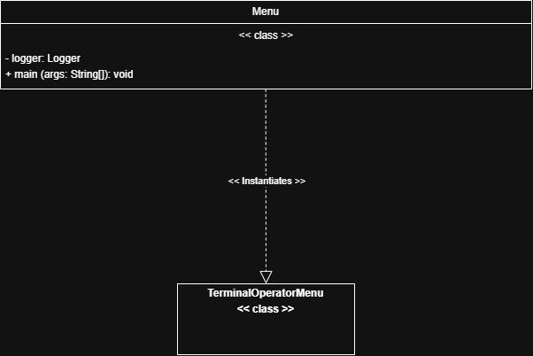

**Terminal Operator**
* Factory
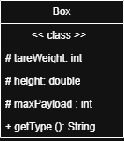
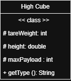
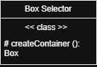
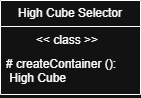

* Iterator
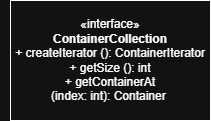
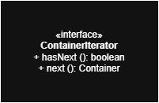
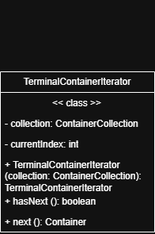
* Singleton
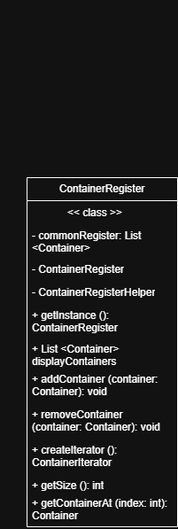
* Composite
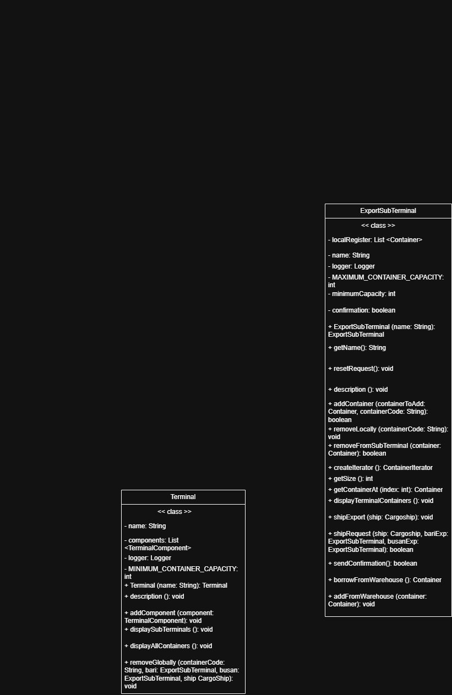
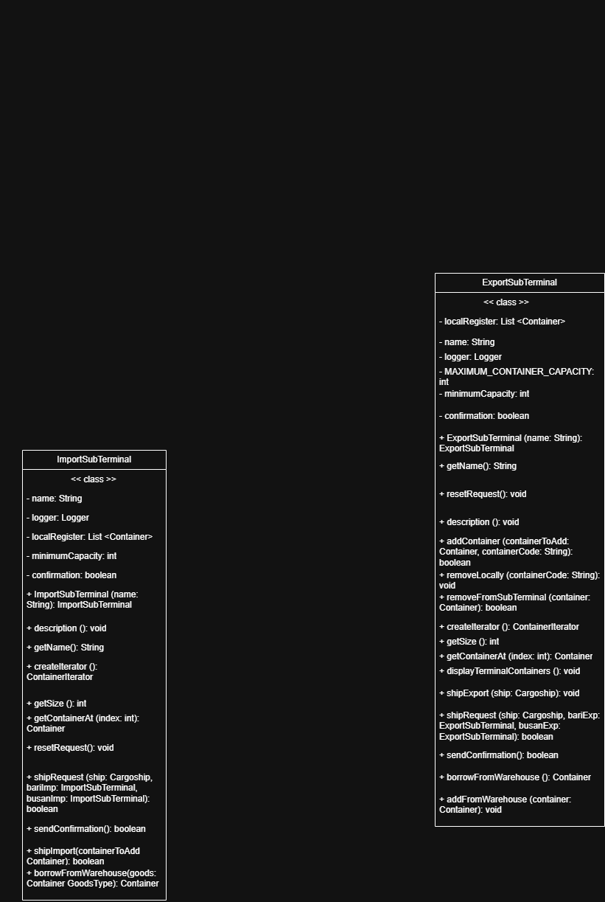

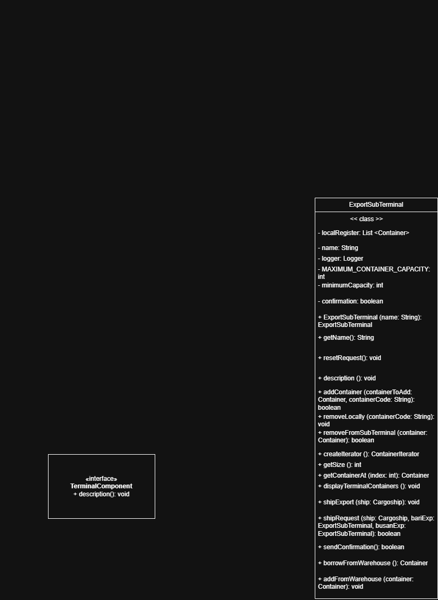

**Cargo Ship Captain**
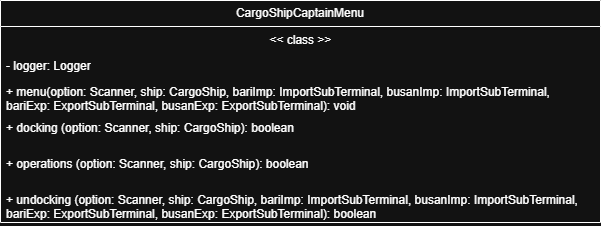
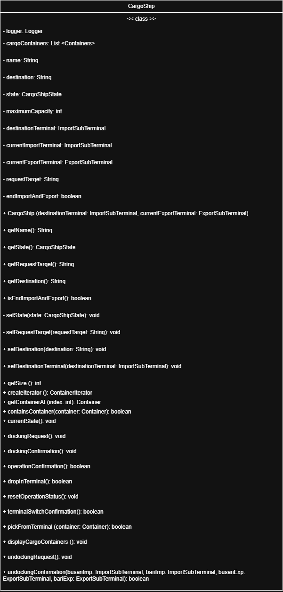

**Warehouse Manager**

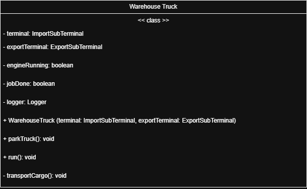
* Abstract Factory
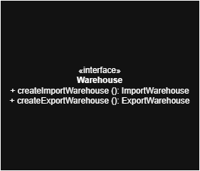

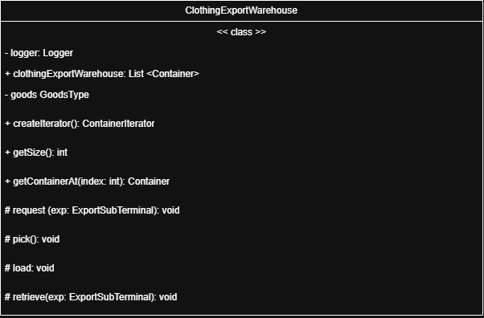

## UML ARCHITECTURAL DIAGRAM
.png)

## Known Limitations and Future Work
### **Known Limitations**
While this project successfully models the core logic of a maritime logistics loop, certain real-world complexities were abstracted or simplified due to the scope of the simulation.
1. Simulation Scope & Actors
* Single Vessel Model: The current system operates with a single cargo ship on a fixed loop (Bari ↔ Busan). Real-world logistics involve multiple fleets, distinct shipping companies, and dynamic scheduling that changes based on external factors (weather, malfunctions, geopolitical events).
* Centralized Operator: The Terminal Operator currently manages both ports from a single menu. A more realistic approach would be decentralized, with distinct operators for Bari and Busan, each managing their own jurisdiction.
* Direct Routes Only: The system assumes a direct link between ports. It does not account for Transhipments, where cargo is offloaded at an intermediate hub and transferred to a different vessel to reach its final destination.
2. Logistics & Infrastructure
Congestion & Queues: The simulation assumes immediate access to resources. It does not model Port Congestion (e.g., truck queues at the gate) or delays caused by simultaneous ship arrivals.
* Inventory Fluctuations: In reality, terminal inventory fluctuates unpredictably, and terminals often run out of specific container types, requiring transfers from other depots. The current model relies on a more static "Safety Buffer" logic.
* Bureaucracy: The system focuses on physical movement. It excludes Customs Operations, declarations, and the complex documentation required for international import/export.

### **Future Work**
Given more time and resources, the following improvements would elevate the project from a simulation to a more robust software solution.
1. Technical Architecture
* Database Integration: Currently, data is held in memory (Java Collections). Implementing SQL or NoSQL persistence would allow the state of terminals and ships to survive application restarts.
* Observer Pattern: To reduce the need for "Polling" (checking status loops), the Observer Pattern could be implemented. This would allow the Terminal to automatically notify the Operator when a ship arrives, or notify the Warehouse Truck immediately when capacity thresholds are breached.
2. Functional Enhancements
* Advanced Filtering: The iteration logic could be expanded to support detailed filtering. This feature was descoped due to time constraints but would allow operators to search containers by specific criteria (e.g., "Show all High Cubes containing Electronics in Bari").
* Enhanced Factory Logic: The relationship between Containers and Goods could be deepened using a more complex Abstract Factory approach, linking specific container structures (Refrigerated, Open Top) to specific goods types (Food, Oversized Cargo) during creation.
* Multi-Ship Concurrency: Upgrading the CargoShip actor to run on its own thread would allow multiple ships to operate simultaneously, requiring more complex synchronization at the docking ports.